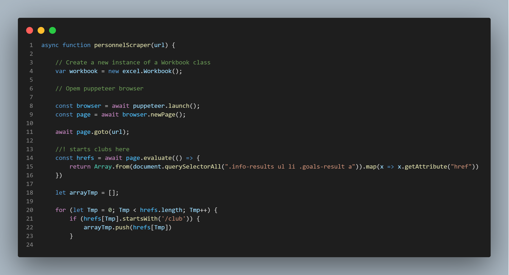

# Web Scrappers For a Algerian Football League Management Database Filling

This Project is a set of web scrappers scripts that are aimed to provide enough data to responde to a Database Creation and Manipulation Project entitled **Algerian Football League Management Database Filling**. You can find all prottype JS files that i used in order to scrap different type of information from the website source.

The data source from website : http://lfwa.dz/

In this project, we used **Puppeteer** as our JavaScript Scrapping library, you can find all the necessary information in the [Puppeteer Docs](https://pptr.dev/)

## Extraction process

 - First, We needed to target the data we want to extract, what ever it is players' data, personnels' data or club data.

 - After that comes establishing the normal graphical behavior planned for the users in order to checkout the data.

 - Once the detailed interaction with GUI of the website is set and done, comes the code and targetting phase. The main task is to translate each interaction to a puppeteer method related to the web page where the interaction is happenning, and then set up the parameters depending on the needs. The puppeteer library will open a background browser to act as our virtual GUI so we can apply the interactions on, each page represend a document object that we can manipulate using the DOM methods implemented in the library

**Note :** Sometimes, when dealing with a low connection, you need to make the code sleep a little bit so the virtual page loads correctly.

 - Finally, after a debugging session, you can run the code and let it for few minutes to extract all the data. You should see the result in the file you targetted to set the data in (in my case, i chosen a xlsx files)/

